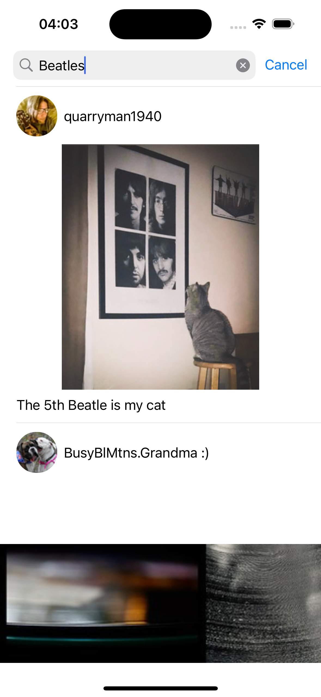
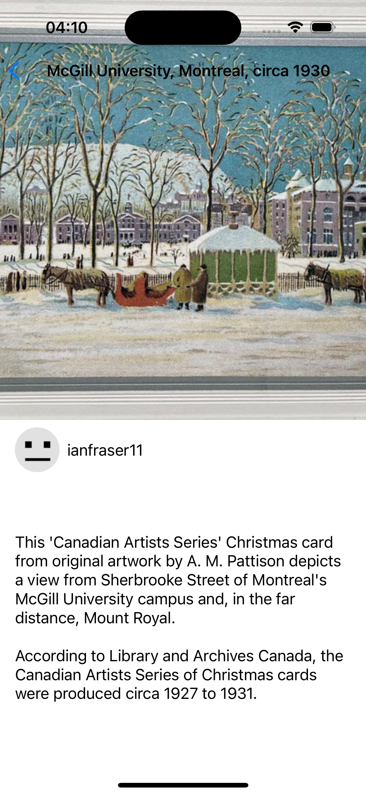

# Flickr App

<details close>
  <summary>Uygulamaya ait ekran görüntülerini görmek için tıklayın.</summary>
   
</details>

## Teknoloji

Swift

## Tools

- API
- Codable
- Table View
- Alert Action

## Özellikler

- Servisten dönen fotoğrafları görebilmek.
- Seçilen fotoğrafın detayını görebilmek.
- Arama yapabilmek.

## API

- Flickr

## Kurulum

Bu depoyu yerel makinenizde klonlayın.

```
git clone https://github.com/ibrahimaykutbas/flickr-app.git
```

### Hazırlık

Projeyi klonladıktan sonra ilgili dizine gidin.

```
cd list-app
open flickr-app.xcodeproj
```

Bu talimatlar, geliştirme ve test amacıyla yerel makinenizde projenin bir kopyasını hazır hale getirecektir.
